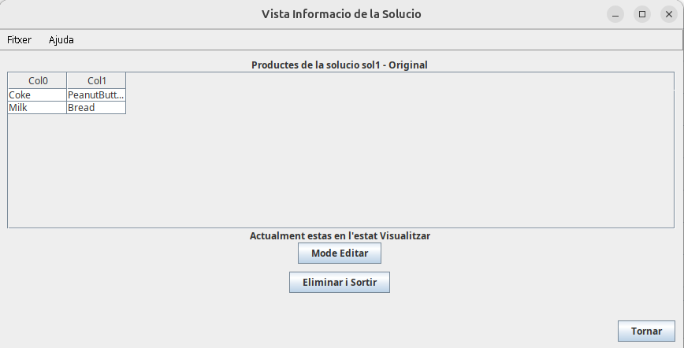

# Supermarket Shelf Optimizer

> Turn a wall of products into a revenue-maximizing layout — by solving a max-weight
> Hamiltonian-path problem with three algorithms built **from scratch** (exact, greedy,
> and a provable 2-approximation).

A desktop application that arranges supermarket products across shelves so that
**similar products end up next to each other** — milk beside yogurt, beer beside chips —
maximizing the cross-selling value of the layout. The user defines a catalog, scores how
"similar" each pair of products is, and the engine computes an optimized distribution.

Built as a team of four for the **Software Engineering & Design (PROP)** course at
*Universitat Politècnica de Catalunya (UPC)*. **Final grade: 9.5 / 10.**

---

## The problem, formally

Model the catalog as a complete weighted graph: each product is a vertex, and the edge
between two products carries their **similarity score** (0–100). Laying products out in a
line so that the sum of similarities between *adjacent* products is maximal is exactly the
**Maximum-Weight Hamiltonian Path** problem — the optimization twin of the Travelling
Salesman Problem, and just as **NP-hard**.

That single fact drives the whole design: there is no one "right" algorithm, so the system
ships three, each making a different trade-off between *optimality*, *speed*, and
*guarantees*. The engine also supports **hard adjacency constraints** ("these two products
must never be neighbors").

## Three solvers, three trade-offs

| Algorithm | Strategy | Guarantee | Cost | Best for |
|-----------|----------|-----------|------|----------|
| **Backtracking** (`AlgorismeBT`) | Exhaustive search with pruning | **Exact optimum**, honors hard constraints | Exponential | Small catalogs where the best layout matters |
| **Greedy** (`AlgorismeGreedy`) | Iteratively attach the most-similar product; multi-start | Fast heuristic | ~O(n²) | Large catalogs, instant feedback |
| **2-Approximation** (`Aproximacio`) | MST → tree doubling → Eulerian → shortcut | **Provably ≤ 2× from optimal**, polynomial time | O(n² log n) | The sweet spot: quality *and* speed |

The 2-approximation is the highlight. It's the classic metric-TSP approximation, and
**every supporting data structure was implemented by hand** rather than pulled from a
library:

- **Kruskal's algorithm** for the maximum spanning tree
- **Union-Find / Merge-Find Set** with path compression (`utils/MergeFindSet`)
- **Hoare-partition quicksort** to sort edges by weight
- **DFS-based Eulerian traversal** and the shortcutting step that turns it into a
  Hamiltonian path

A full walkthrough of all three algorithms lives in
**[`src/main/java/layers/domain/README.md`](src/main/java/layers/domain/README.md)**.

## Architecture

A textbook **three-layer architecture** with one-way dependencies
(`presentation → domain → persistence`), so the optimization core has zero knowledge of the
UI or the file system.

```
layers
├── presentation     Swing GUI: views + view-controllers (MVC)
│   ├── views            VistaPrincipal, VistaInfoSolucio, ...
│   ├── controllers      CtrlPresentacio (Singleton), per-view controllers
│   └── utils            reusable Swing components
├── domain           the brain
│   ├── (root)           Producte, Solucio, the 3 Algorisme* solvers
│   ├── controllers      CtrlDomini (Singleton facade) + catalog/solution controllers
│   ├── utils            MergeFindSet, Pair — hand-rolled data structures
│   └── excepcions       typed domain exceptions
└── persistence      import/export of catalogs and solutions to disk
```

Design choices worth noting: **Singleton** facade controllers at each layer boundary,
custom **typed exceptions** for every class of invalid user input, and a domain layer
that is fully **headless-testable** — which is exactly why a CLI driver (see below) can
exercise it without touching Swing.

## Build & run

Requires **JDK 21+** (the project's Gradle toolchain is pinned to 21). No global Gradle
install needed — the wrapper handles it.

```bash
./gradlew run     # launch the Swing GUI
./gradlew test    # run the full unit-test suite
./gradlew jar     # build a runnable jar in build/libs/
```

> The GUI and in-code documentation are in **Catalan** (the course language).
> *Gestionar catàleg* = manage catalog, *Gestionar solucions* = manage solutions,
> *Importar / Exportar* = import / export.

<p align="center">
  
  <br/>
  
</p>

### Alternative: headless CLI

`layers.domain.Driver` is a text-mode entry point from an earlier milestone that drives the
domain layer directly — a neat demonstration that the optimization engine is completely
decoupled from the GUI. Run it by pointing the application plugin at
`layers.domain.Driver` (or invoke `Driver.main` from your IDE).

## Testing

- **105 JUnit tests** across 11 test classes — every algorithm, controller, and data
  structure has unit coverage (JUnit 4 + Mockito).
- **13 end-to-end functional test cases** (*jocs de prova*) under
  `src/test/java/layers/JocsDeProva/`, each a scripted scenario with paired
  input/expected-output files.

Details and the test-file format are in
**[`src/test/java/layers/README.md`](src/test/java/layers/README.md)**.

## Tech stack

`Java 21` · `Swing` · `Gradle (wrapper)` · `JUnit 4` · `Mockito` — no algorithmic
dependencies; the optimization core is pure, dependency-free Java.

## Authors

A four-person team for UPC's PROP course. Contribution breakdown derived from the git
history:

### [Lluc Santamaria Riba](https://github.com/Lluc24) — `@Lluc24`
- **2-Approximation algorithm** (`Aproximacio`) and its hand-built `MergeFindSet` (Union-Find)
- Domain facade `CtrlDomini`, `CtrlGeneric`
- Presentation backbone: `Main` entry point, `CtrlPresentacio`, `CtrlVistaGeneric`, and the
  reusable Swing widgets `BotoGeneric` / `MenuItemGeneric`
- Views `VistaPrincipal`, `VistaGenerica`, and the large `VistaInfoSolucio` (solution editor)
- The legacy headless CLI `Driver`
- Tests: `TestAproximacio`, `TestMergeFindSet`, `TestCtrlCataleg`

### [Efraín Tito Cortés](https://github.com/Efrain-T-C) — `@Efrain-T-C`
- **Backtracking** (`AlgorismeBT`) and **Greedy** (`AlgorismeGreedy`) solvers + the shared
  `Algorisme` base class
- Catalog-with-restrictions logic: `CtrlCatalegAmbRestriccions` and its view-controller
  `CtrlVistaCatalegAmbRestriccions`
- Catalog persistence `CtrlPersistenciaCataleg`
- View `VistaConsultarRest`
- Tests: `TestAlgorismeBT`, `TestAlgorismeGreedy`, `TestCtrlCatalegAmbRestriccions`

### [Eulàlia Peiret Santacana](https://github.com/eulaliapeiret) — `@eulaliapeiret`
- **Solution model**: `Solucio`, `SolucioModificada`, and the `CtrlSolucions` controller
- Most of the **persistence layer**: `CtrlPersistencia`, `CtrlPersistenciaGeneric`,
  `CtrlPersistenciaSolucio`
- Presentation `CtrlVistaSolucions` and views `VistaPrincipalSolucions`,
  `VistaGestioAlgorisme`, `VistaControladors`
- Tests: `TestCtrlSolucions`, `TestSolucio`, `TestSolucioModificada`

### [Alejandro Lorenzo](https://github.com/Alito18) — `@Alito18`
- **Product model** `Producte` and the generic `Pair` utility
- Catalog controller `CtrlCataleg`
- Views `VistaAfegirProducte`, `VistaInfoProducte`, `VistaPrincipalCataleg`
- Tests: `TestProducte`, `TestPair`
</content>
